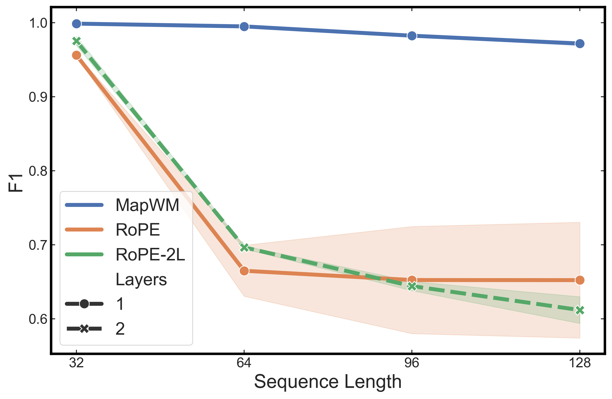
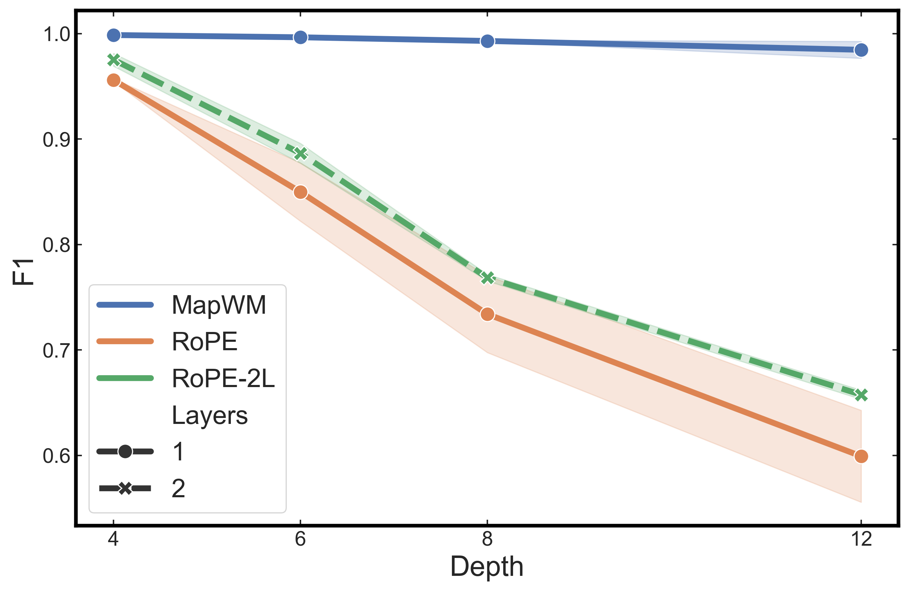
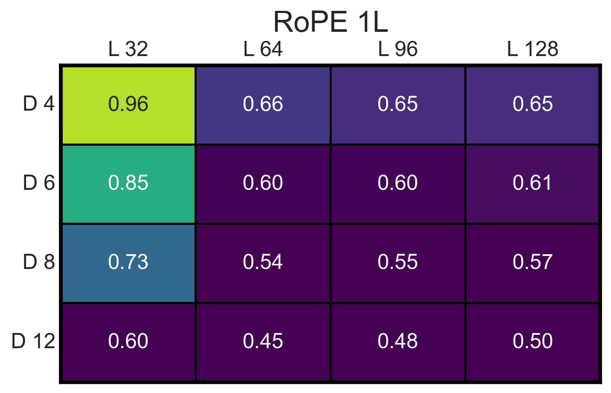
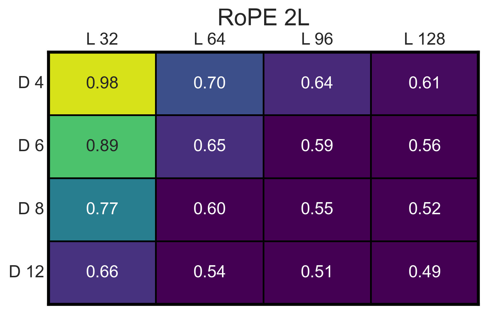
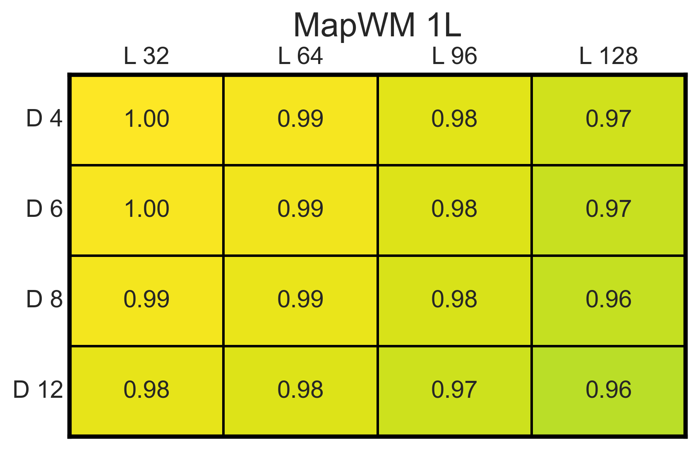

# Supplementary Results: MapFormer Benchmarks

We further tested MapFormer on semi-natural and natural language. To verify that the mechanism allowing the learning of cognitive maps can be extended to formal languages, we tested on Dyck-2. Dyck-n is a context-free language that tests a model's ability to handle nested dependencies, via sequences of balanced parentheses. It has been empirically proven that standard transformers fail to generalize to longer sequences and depth than those seen in training.

## 1. MapFormer generalize to Dyck-2 formal language
Sequences were generated by first defining a target length and depth. Sequences were sequentially generated by varying the sampling probability of opening or closing a bracket based on currents depth and remaining steps. We tested our models on sequences of size 32 and depth 4.
We compared a MapFormerWM with a single layer and one head of size 128, to our best performing RoPE models, mainly 2 layers 4 heads of size 64. We also compared it to the same model with a single layer.
MapWM shows near perfect length and depth generalization, while RoPE performances quickly degrade beyond traing depth or length:

*Figure 1: MapWM are more robust than RoPE while sequence length extends beyond training distribution

*Figure 1: MapWM are more robust than RoPE while sequence depth extends beyond training distribution

*Figure 1: RoPE fail to generalize to unseen depth or length

*Figure 1: RoPE fail to generalize to unseen depth or length

*Figure 1: MapWM generalize to unseen depth and length*

